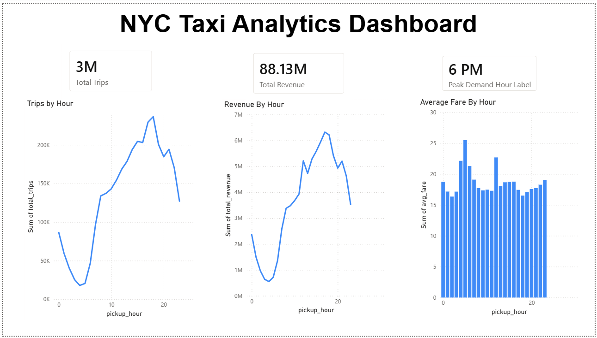

# NYC Taxi Analytics Platform

## Overview

An end-to-end data engineering and analytics platform built using NYC Yellow Taxi trip data. The project processes over 3.4 million taxi trip records, performs ETL transformations, generates business insights, stores analytics-ready data in PostgreSQL, and visualizes key metrics through an interactive Power BI dashboard.

---

## Architecture

NYC Taxi Dataset (Parquet)
        ↓
Python ETL Pipeline
        ↓
Data Cleaning & Feature Engineering
        ↓
PySpark Processing
        ↓
PostgreSQL Database
        ↓
SQL Analytics
        ↓
Power BI Dashboard

---

## Tech Stack

- Python
- Pandas
- PySpark
- PostgreSQL
- SQL
- Power BI
- Git & GitHub
- Apache Airflow (Planned Enhancement)

---

## Dataset

Source:

NYC Taxi & Limousine Commission (TLC)

Dataset Used:

- Yellow Taxi Trip Records (January 2025)

Records Processed:

- 3.4M+ taxi trips

---

## Features

### Data Cleaning

- Removed invalid trip records
- Filtered negative fare and distance values
- Handled missing data

### Feature Engineering

Created:

- Trip Duration
- Pickup Hour
- Pickup Day
- Pickup Month

### Analytics

Calculated:

- Total Trips by Hour
- Average Fare by Hour
- Average Distance by Hour
- Total Revenue by Hour

### Database Integration

- Stored analytics-ready data in PostgreSQL
- Executed SQL-based business analysis

### Dashboarding

Created interactive Power BI dashboards for:

- Demand Analysis
- Revenue Trends
- Fare Analysis
- KPI Monitoring

---

## Key Business Insights

### Peak Demand Hour

- 6 PM (18:00)
- 236,588 trips

### Highest Average Fare Hour

- 5 AM
- Average Fare: $25.48

### Total Revenue

- $88.13M+

---

## Dashboard Preview



---

## Project Structure

```text
nyc-taxi/
│
├── airflow/
├── dashboard/
├── data/
├── database/
├── etl/
├── notebooks/
├── reports/
├── spark_jobs/
├── README.md
└── requirements.txt
```

## How to Run

### Clone Repository

```bash
git clone https://github.com/RushilManidhanJangala/nyc-taxi.git
cd nyc-taxi
```

### Create Virtual Environment

```bash
python -m venv venv
```

### Activate Environment

```bash
venv\Scripts\activate
```

### Install Dependencies

```bash
pip install -r requirements.txt
```

### Run ETL Pipeline

```bash
python etl/transform.py
python etl/aggregate.py
```

### Load Data into PostgreSQL

```bash
python database/load_hourly_stats.py
```

---

## Future Enhancements

- Apache Airflow workflow orchestration
- Automated data ingestion
- Docker containerization
- Cloud deployment (AWS/GCP/Azure)
- Real-time streaming analytics

---

## Author

Rushil Manidhan Jangala

Arizona State University (May 2026)